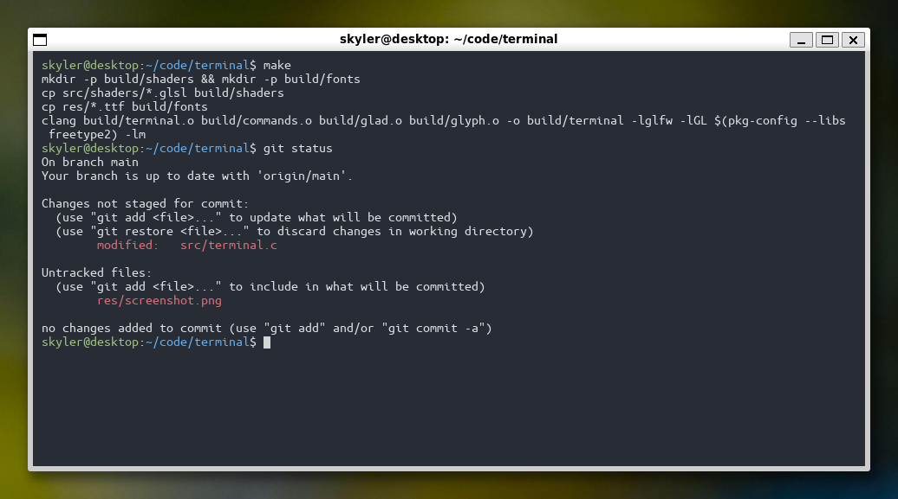

## terminal

A terminal emulator for Linux written in C, made for fun. The terminal uses FreeType to render glyphs from a font file to an OpenGL texture, and a fragment shader to select pixels from the correct glyph.

Common ANSI escape sequences are supported, including cursor movement and 16 color presets.



## Building

The terminal has dependencies on FreeType for font handling, GLFW for window and input handling, and CGLM for matrix operations. The executable is built with Make.
```
# Install dependencies (Ubuntu/Debian example)
sudo apt install libfreetype6-dev libglfw3-dev libcglm-dev

# Build and run
make
./build/terminal
```
